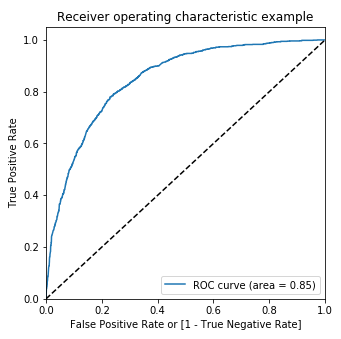

# Logistic-Regression

<h2>A Logistic regression model build to predict whether a customer will churn or not based on various features such as tenure, contract, payment method, gender and many other features.</h2>
<h3>The significant features are selected using Recursive Feature Selection and also using Variance Inflation Factor & p-values</h3>
<h3>Data :</h3>
<pre>
     customerID  tenure PhoneService        Contract  ... DeviceProtection TechSupport  StreamingTV StreamingMovies
0  7590-VHVEG       1           No  Month-to-month  ...               No          No           No              No
1  5575-GNVDE      34          Yes        One year  ...              Yes          No           No              No
2  3668-QPYBK       2          Yes  Month-to-month  ...               No          No           No              No
3  7795-CFOCW      45           No        One year  ...              Yes         Yes           No              No
4  9237-HQITU       2          Yes  Month-to-month  ...               No          No           No              No
</pre>

<h3>Summary of the model :</h3> 
<pre>
                   Generalized Linear Model Regression Results
==============================================================================
Dep. Variable:                  Churn   No. Observations:                 4922
Model:                            GLM   Df Residuals:                     4908
Model Family:                Binomial   Df Model:                           13
Link Function:                  logit   Scale:                          1.0000
Method:                          IRLS   Log-Likelihood:                -2025.9
Date:                Tue, 26 May 2020   Deviance:                       4051.9
Time:                        20:42:35   Pearson chi2:                 5.25e+03
No. Iterations:                     7
Covariance Type:            nonrobust
=========================================================================================================
                                            coef    std err          z      P>|z|      [0.025      0.975]
---------------------------------------------------------------------------------------------------------
const                                    -1.6577      0.127    -13.094      0.000      -1.906      -1.410
tenure                                   -0.9426      0.065    -14.480      0.000      -1.070      -0.815
PaperlessBilling                          0.3455      0.089      3.877      0.000       0.171       0.520
SeniorCitizen                             0.4597      0.100      4.613      0.000       0.264       0.655
Contract_One year                        -0.7218      0.127     -5.702      0.000      -0.970      -0.474
Contract_Two year                        -1.2987      0.208     -6.237      0.000      -1.707      -0.891
PaymentMethod_Credit card (automatic)    -0.3874      0.113     -3.442      0.001      -0.608      -0.167
PaymentMethod_Mailed check               -0.3307      0.110     -3.020      0.003      -0.545      -0.116
InternetService_Fiber optic               0.8052      0.097      8.272      0.000       0.614       0.996
InternetService_No                       -0.9726      0.155     -6.261      0.000      -1.277      -0.668
MultipleLines_Yes                         0.2097      0.092      2.279      0.023       0.029       0.390
TechSupport_Yes                          -0.4046      0.101     -4.019      0.000      -0.602      -0.207
StreamingTV_Yes                           0.3390      0.094      3.619      0.000       0.155       0.523
StreamingMovies_Yes                       0.2428      0.093      2.598      0.009       0.060       0.426
=========================================================================================================
</pre>
<h3>Confusion Matrix :</h3>
<pre>
 [[2791  844]
 [ 288  999]]
 </pre>
<h3>Accuracy :  0.7700121901665989</h3>
<h3>Specificity :  0.7678129298486933</h3>
<h3>Sensitivity :  0.7762237762237763</h3>
<h3>True Positive Rate :  0.7762237762237763</h3>
<h3> ROC Curve :</h3>

